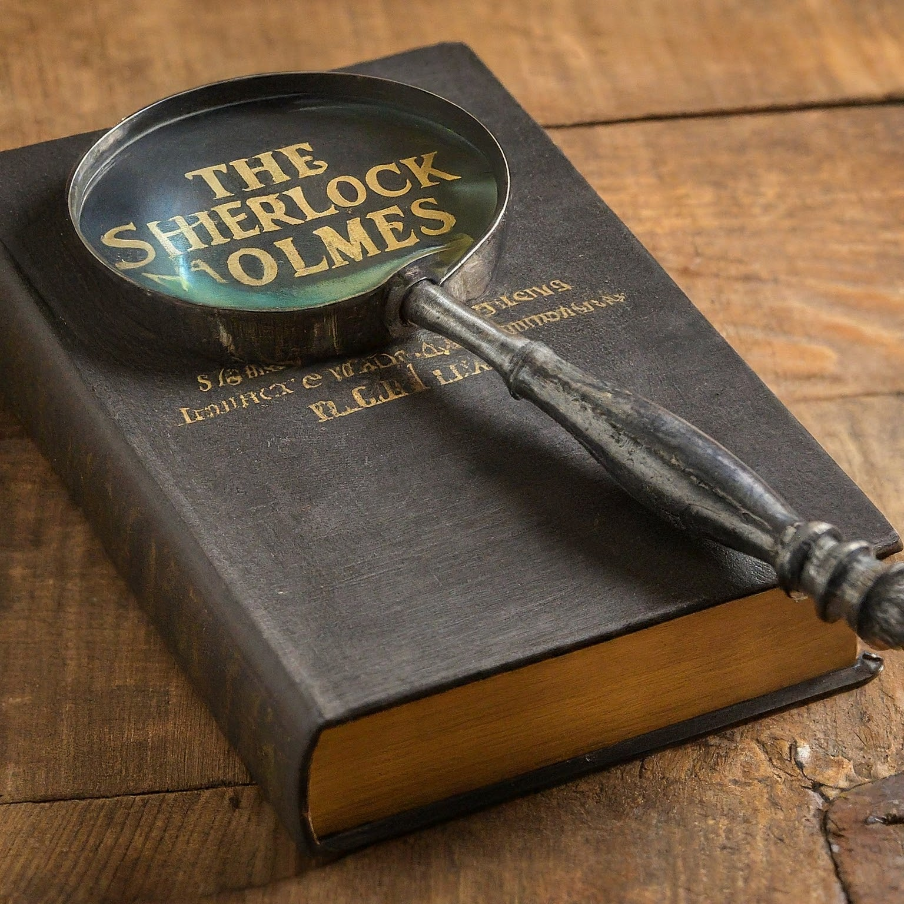

# Sherlocked: A RAG-Powered Guide to the World of Sherlock🕵️

[](#)

**Sherlocked** is an innovative project that allows you to delve into the world of Sherlock Holmes by asking questions about the stories. Leveraging cutting-edge technologies, it scrapes and processes the entire Sherlock Holmes collection to provide accurate and insightful answers.

## ✨ Features

* **Comprehensive Scraping:** Automatically gathers text data from all Sherlock Holmes books.
* **Advanced Parsing:** Utilizes LLaMA Parse for powerful and precise text processing.
* **Efficient Processing:** Integrates GROQ for high-performance data manipulation.
* **Relevant Answers:** Employs Flashrank Reranker to prioritize the most pertinent information.
* **Natural Language Understanding:** Uses LangChain for seamless interaction in plain English.

## 🚀 Installation

1. **Clone:** `git clone https://github.com/nisargnegi/Sherlocked_RAG_Llama3_LlamaParse_Groq/new/main?filename=README.md#usage`
2. **Navigate:** `cd Sherlocked`
3. **Dependencies:**
   ```bash
    pip -qqq install pip --progress-bar off
    pip -qqq install langchain-groq==0.1.3 --progress-bar off
    pip -qqq install langchain==0.1.17 --progress-bar off
    pip -qqq install llama-parse==0.1.3 --progress-bar off
    pip -qqq install qdrant-client==1.9.1 --progress-bar off
    pip -qqq install "unstructured[md]"==0.13.6 --progress-bar off
    pip -qqq install fastembed==0.2.7 --progress-bar off
    pip -qqq install flashrank==0.2.4 --progress-bar off
   ```
  
5. **API Keys:**
    * Get your GROQ API keys from [GROQ Cloud](https://console.groq.com/playground).
    * Get your LLaMA Cloud API keys from [LLaMA Cloud](https://cloud.llamaindex.ai/).

## 📖 Usage

Open the `Sherlocked.ipynb` Google Colab Notebook for detailed instructions on scraping and querying. 

**Example Questions & Answers:**

* **Question:** Who was the great hound really?  
   **Response:** The great hound was a curly-haired spaniel, not a supernatural creature.   
   Additional information: 
   - The hound was a real dog, not a spectral or hellish creature, as suggested by the family legend.
   - The dog was used by Stapleton to create the illusion of a supernatural hound, in an attempt to frighten Sir Charles to death.
   - The dog was kept in the out-house at Merripit House, and was occasionally taken out to create the illusion of a ghostly hound on the moor.
   - The dog was daubed with a luminous mixture to make it appear eerie and supernatural.
   
* **Question:** How did Irene trick Sherlock?  
   **Response:** Irene Adler outwitted Sherlock by escaping his detection in the case of the King of Bohemia.   
   Additional information:
   - Irene Adler was a clever and cunning opponent who managed to outwit Sherlock Holmes, which was a rare occurrence.
   - Her cleverness and intelligence earned her a special place in Holmes' memory, and he referred to her as "the woman" in later conversations.

* **Question:** How does Sherlock feel about his family?  
   **Response:** Sherlock is reserved about his family, but he mentions his brother Mycroft.  
   Additional information:
   - Sherlock's ancestors were country squires, and his grandmother was the sister of Vernet, a French artist.
   - He believes that his faculty of observation and deduction may be hereditary, citing his brother Mycroft as an example of someone who possesses these traits to a greater degree than he does.


## 🤝 Contributing

Contributions are encouraged! Fork the repository and submit a pull request with your changes.  Open an issue first for major changes.

## 📄 License

MIT License.

## 🙌 Acknowledgments

Special thanks to the following technologies and projects:

* [LLaMA Parse](https://github.com/facebookresearch/llama)
* [GROQ](https://groq.com/)
* [Flashrank Reranker](https://github.com/PrithivirajDamodaran/FlashRank)
* [LangChain](https://github.com/langchain)
* [Sherlock Holmes stories data source](https://sherlock-holm.es/)
---

Delve into the world of Sherlock Holmes with Sherlocked! Your questions about the cases, characters, and mysteries await.
